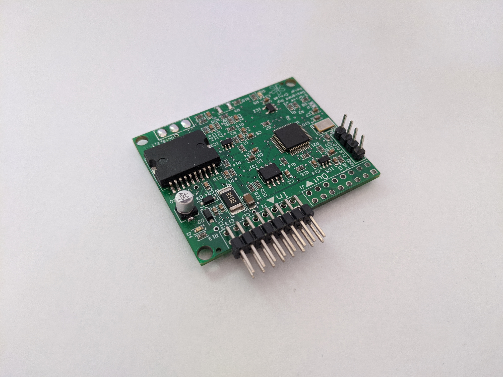

About S-Drive project
=======================================

.. meta::
   :description lang=en: About S-Drive project

What is S-Drive project?
---------------------------

S-Drive project is open-source project with aim to make good BLDC control for robotics cheap and available to everybody.
Primary use for this project is in: Compliant robotic arms, dynamic walker robots, camera gimbals ...
Goal is to make everything simple to use and integrated but at the same time allow a lot of experimentation and ability for advanced development!

What does S-Drive project consist of?
--------------------------------------

S-Drive BLDC driver board 
--------------------------------------

- is small BLDC driver board with all needed functions integrated in!

S-Drive BLDC driver firmware
--------------------------------------

- is firmware specially developed for S-Drive BLDC driver board.

S-Drive BLDC driver control software
--------------------------------------

- lets you control and monitor motor connected to S-Drive BLDC driver!

.. figure:: ../docs/images/control_software.png
    :figwidth: 750px
    :target: ../docs/images/control_software.png
    
        
Table of contents
------------------

licence
--------

Support the project
-------------------

This project is completely Open source and free to all and I would like to keep it that way, so any help 
in terms of donations or advice is really appreciated. Thank you!

.. image:: ../docs/images/PayPal-Donate-Button-PNG-Clipart.png
   :width: 230
   :target: https://paypal.me/PCrnjak?locale.x=en_US
   
   
