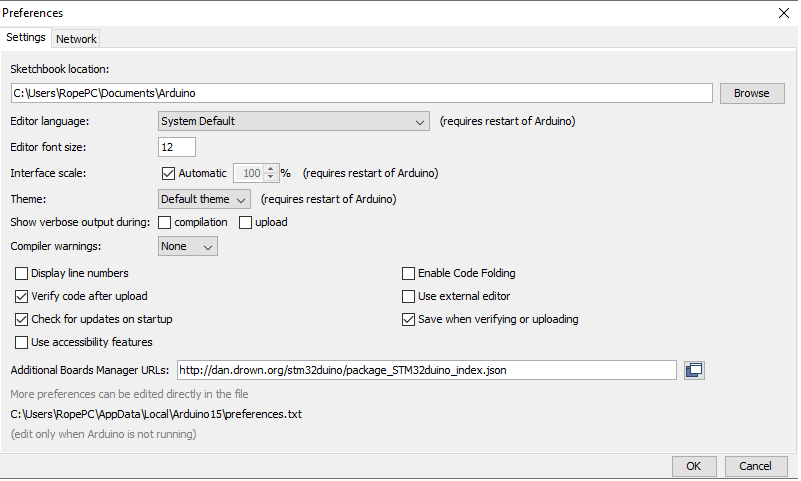
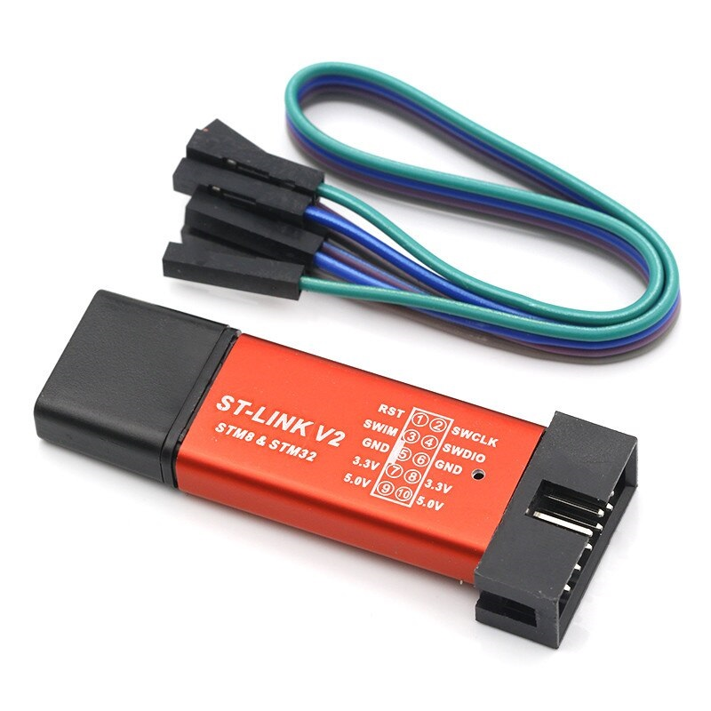
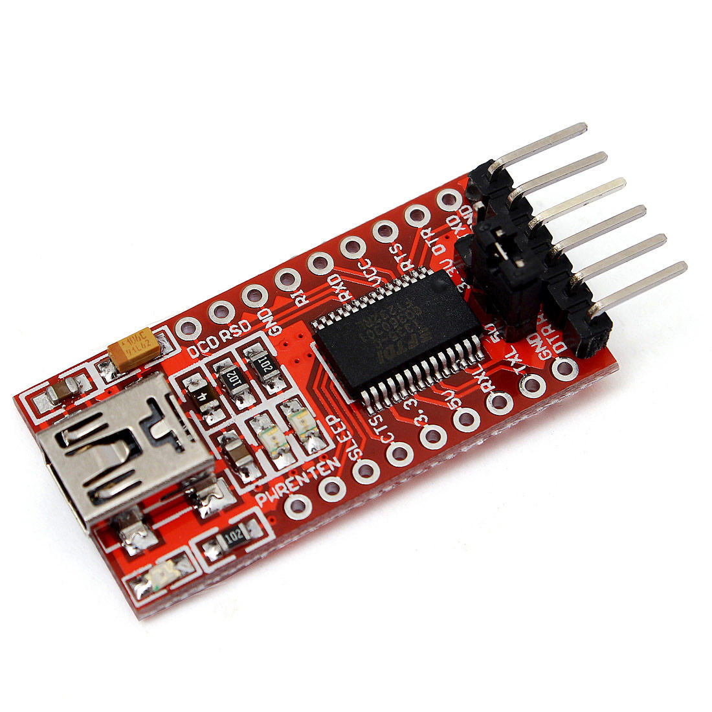

Arduino IDE setup for S-Drive firmware
=======================================

.. meta::
   :description lang=en: Arduino IDE setup for S-Drive firmware

Firs download Arduino IDE from official website: 
(Version we are running is 1.8.13)

Run Arduino IDE, go to file/preferences/additional boards manager urls:
Enter : http://dan.drown.org/stm32duino/package_STM32duino_index.json
(Any additional json file is sepperated with ,)

Now go to tools/board/board manager and search for STM32
Select STM32F1XX/GD32F1XX BOARDS
(We used version 2020.8.9.)

.. figure:: ../docs/images/Boards_manager.png
    :figwidth: 650px
    :target: ../docs/images/Boards_manager.png

Now downlaod needed libraries from S-Drive firmware repo:
We recommend using versions of libraries from this repo for compatiblitiy.
Using new versions can cause issuses!!

Copy needed libs to libraries folder of your Arduino IDE instalation.

We are almost done!

    
To program S-Drive BLDC driver board use ST-link.
Windows 10 will usually download drivers alone, but if it does not download them from  here:
Note (STM32cubeprogramer is used for ARDUINO FOC firmware)
https://my.st.com/content/my_st_com/en/products/development-tools/software-development-tools/stm32-software-development-tools/stm32-programmers/stm32cubeprog.license=1598927090654.product=STM32CubeProg.version=2.5.0.html 

or just drivers here: https://www.st.com/en/development-tools/stsw-link009.html

    
To acces serial port you need FTDI TO USB board.
Windows 10 will usually download drivers alone, but if it does not download them from  here:
https://www.ftdichip.com/Drivers/VCP.htm

Troubleshooting
-----------------

