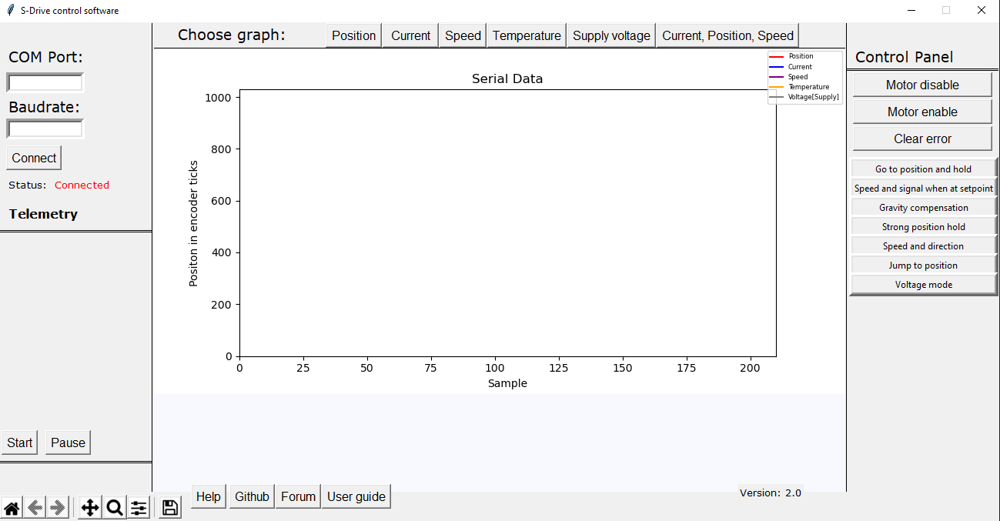

S-Drive control software
=======================================

.. meta::
   :description lang=en: S-Drive control software
   
Latest version: Version 2.0
   
About
-----------------

S-Drive control software lets you control and monitor S-Drive motor from PC. 
This version supports plotting, showing data and controlling of only one motor at the time.
S-Drive control software allows you to see live data from your motor like:

* speed
* current 
* position
* temperature
* BEMF

AND at the same time control the motor in few different modes like:

* Go to position and hold
* set speed and flag at setpoint
* Gravitiy compensation
* Strong position hold
* Speed and direction
* Jump to position
* Voltage mode

GUI guide - left side of screen
-------------------------------

    

On the left side you can see:

* COM PORT: here you enter at what COM port your FTDI to USB board is connected to!
* BAUDRATE: here you enter baudrate at wich your S-Drive board and control software communicate at.

.. note::

    Note BAUDRATE is usually 1000008 or 1000000 in S-Drive Firmware
    
* Status: Connected - GREEN for connected . RED for NOT connected
* Telemetry is will print useful data about the motor.
* Start will start serial communication, it can also be used to start wihout entering COM PORT and BAUDRARE values 
To use it like that in python script edit bottom lines to COM PORT and BAUDRATE you are using!

.. code-block:: python
   :linenos:
   
   s.baudrate = 1000000
   s.port = 'COM3'
   
To COM PORT and BAUDRATE you are using!

* Now if you use that edited script you can always connet to that com port with that baudrate when pressing START.
* PAUSE pauses serial communication. To resume it PRESS start again!
* On bottom is tkinter tool to navigate graphs!

GUI guide - Middle of screen
-----------------------------

On the middle you can select what graph to view!
Only one can be active at the time, or you can view multiple by selecting "Current,Position and Speed".

GUI guide - Right side of screen
-----------------------------

Here you can:

* DISABLE MOTOR - turns off MOSFTETS
* ENABLE MOTOR - Goes to POSITION HOLD on CURRENT POSITION!
* CLEAR ERROR - clears ERROR from motor.

.. note::
    
    if motor sends it still has error usually it means that temperature is still to high and it will disable 
    itself again

After CLEAR ERROR are motor modes:

* Go to position and hold - Goes to position with specific speed and holds desired position with desired Kp and current treshhold
* set speed and flag at setpoint - Rotate at specific speed to desired setpoint at wich driver will send done flag
* Gravitiy compensation - Gravitiy compensation mode 
* Strong position hold - Strong position hold on current position with desired Kp and current treshhold
* Speed and direction - Move with desired speed in desired direction
* Jump to position - Jump to desired position 
* Voltage mode - Move motor in desired direction my setting voltage to the driver

.. note::

    voltage is in value from 0 - 1000 , 0 being zero volt 1000 being power supply voltage (peak)

Requirements to work!
----------------------

In S-Drive firmware in Motor_parameters file you NEED to adjust :

.. code-block:: python
   :linenos:
   
   uint16_t Main_serial_output_time = 50000;
   
Usually it is 10000, but that is to fast for S-Drive control firmware!

Troubleshooting
----------------------

Simple "How it works"
----------------------

