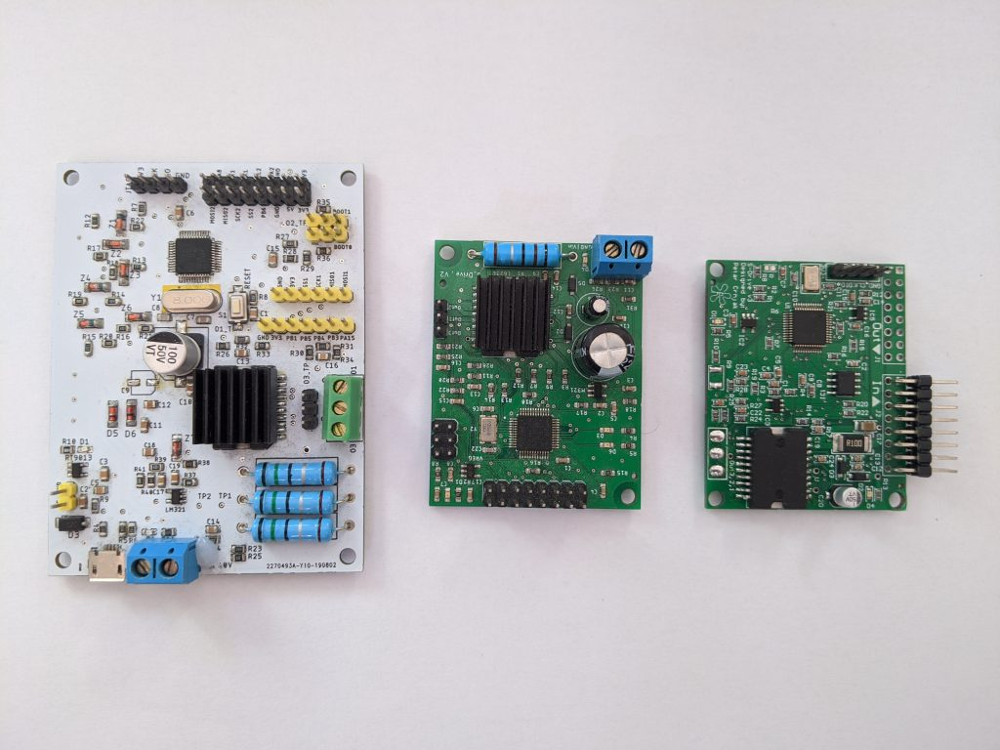
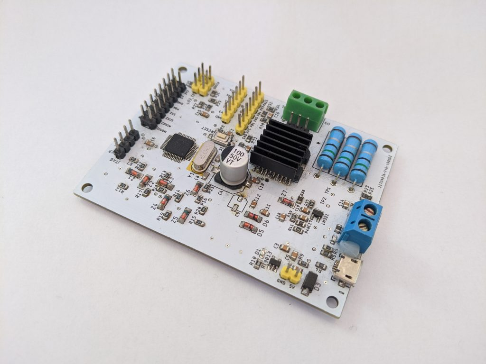
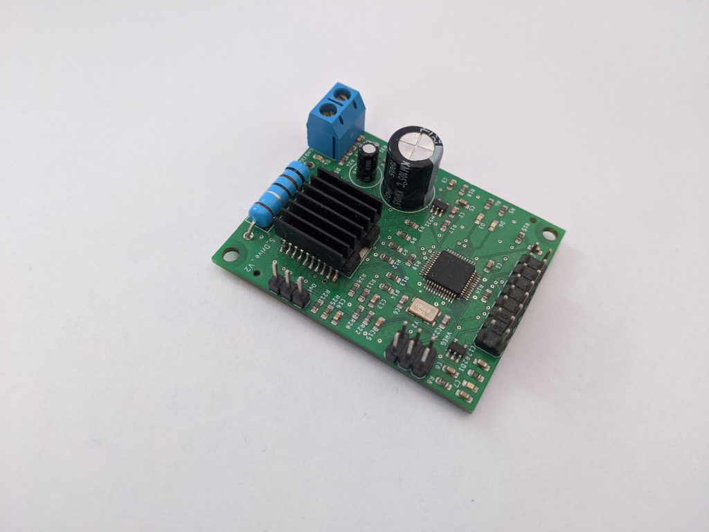
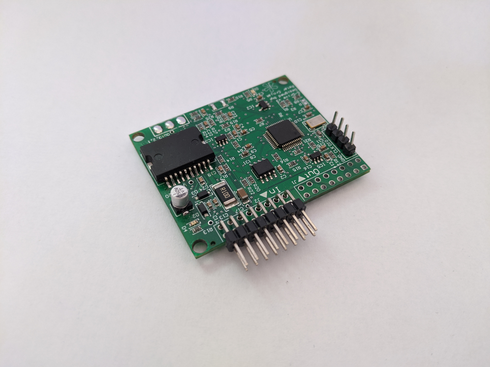

Driver versions
=======================================

.. meta::
   :description lang=en: Driver versions
   
S-Drive BLDC driver Version 3.1 (Latest version)
-------------------------------------------

    
Whole S-Drive project started in july 2019 with simple breadboard prototype.
From the very beginning project was planned to be used for robotic arms and legged robots,
but to do that size was needed to be reduced.
   
S-Drive BLDC driver version 1  (August 2019)
------------------------------

    
First version was large and mostly made for prototyping and testing features.
It used a lot of large components and had all pins from MCU routed as header pins for testing.
Also It had usb plug and bootloader support, but that feature was removed to reduce size.
Zener diodes were used on PULS and ENABLE pins for protection, but they were also removed to reduce size.
As you can see it used a lot of large components like those blue and green connectors and resistors were definitely oversized.
At that time i did not know what what type of communication I would so so multiple stuff was tested like : I2C, UART and SPI.
This board was hand assembled. It uses 0805 components.

S-Drive BLDC driver version 2  (December 2019)
------------------------------

Second version is much smaller and looks similar to V3 but in reality it is more similar to first version.
At this board I learned what needed to be made for V3 that is first stable version.
From this board I also learned that board needs to have encoder embedded.
This version was assembled by machines and uses 0603 components.

S-Drive BLDC driver version 3 rev1  (July 2020)
-----------------------------------------------

This is third version of S-Drive, it is newest and stable version where everything is working.
What is different from V1 and V2:

* RS485 chip for daisy chain ability
* removed all large connectors
* Additional EEPROM chip
* No large connectors
* All connectors were replaced with 2 connection buses where each bus has high voltage lines, UART comms, RS485 comms and low power lines
* termistor connector
* Small size of 50 x 41 mm
* additional signal LEDs
* Encoder is on bottom side! 
    
    
S-Drive BLDC driver version 3 rev2  (In making)
-----------------------------------------------
